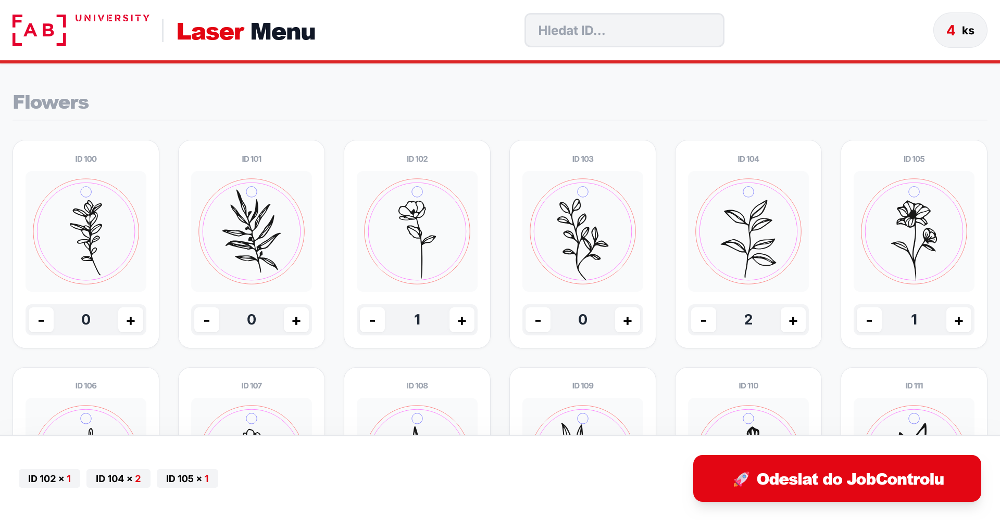

# ⚡ FabLab - Laser Menu


---

## 📖 About the Project

I decided to take on this project because of all the unnecessary extra work that just kept repeating itself. Copy an image, send it to print, delete it, copy it again - and so on, over and over.

**Laser Menu** acts as a lightweight web catalog. A student picks motifs on their phone or laptop, sets the quantity, and sends them with one click. They immediately appear in the **JobControl** print queue on the laser PC.

### Key Features:
*   🚀 **Lightning Fast:** Instant loading of the motif library.
*   📂 **Auto-Categories:** Just create a folder and the menu updates itself.
*   🔍 **ID Search:** Find your motif by its number in seconds.
*   🛒 **Smart Cart:** Select multiple items and send them all at once.
*   🖥️ **App Mode:** Opens in a clean browser window without distracting bars.

---

## 📂 Project Structure

File structure of entier project:

```text
📁 fablab-laser-menu/
├── 🎨 client/
│   ├── 📦 assets/
│   │   ├── 📐 svg/          <-- Drop your folders (Categories) with motifs (ID.svg) here
│   │   └── 🖼️ logo.svg       
│   ├── 📜 app.js            
│   └── 🌐 index.html        
├── 🖥️ server/
│   ├── 🐍 main.py          
│   └── 📄 requirements.txt  
├── 🕵️ .gitignore            
└── 📖 README.md                    
```

## 🛠️ Installation

### Prerequisites
Before you begin, ensure you have the following installed on your system:
*   **Python 3.8+**: The core engine of the server.
*   **Inkscape**: Required for high-precision vector printing. **Important:** Add the Inkscape installation folder to your system's `PATH` variable so the script can call it via terminal.
*   **JobControl**: Must be installed and running on the PC connected to the laser cutter.

### Setup
1.  **Clone the repository**:
    Open your terminal or command prompt and run:
    ```bash
    git clone https://github.com/slanja/fablab-laser-menu.git
    cd fablab-laser-menu
    ```

2.  **Install Python dependencies**:
    Install all necessary libraries using the provided requirements file:
    
```bash
    pip install -r server/requirements.txt
```

3.  **Verify Inkscape CLI**:
    Check if Inkscape is correctly recognized by your system by typing:
    ```bash
    inkscape --version
    ```
    If you see the version number, you are good to go!

## 🚀 Launching

### 1. Start the Server
Open your terminal in the project root directory and run the Python backend. This script acts as both the API for the motif library and the print agent.
```bash
python server/main.py
```

### 2. Accessing the Menu
*   **On the Laser PC:** The script is designed to automatically open a clean, app-like browser window (Firefox or Chrome). If it doesn't open automatically, simply go to `http://localhost:3000/\client/`.
*   **From Other Devices:** Students can access the menu from their phones or tablets by connecting to the same Wi-Fi and entering your computer's IP address: `http://<your-pc-ip>:3000/\client/`.

### 🧪 Testing & Simulation
If you are developing from home or don't have a laser cutter connected, you can enable **Simulation Mode** in `server/main.py`. 
```py
# In server/main.py
SIMULATION_MODE = True
```
In this mode, clicking "Print" won't actually call Inkscape or the printer; instead, it will log a success message to your terminal, allowing you to test the full web workflow.

### 💡 Pro Tip: Create a Desktop Shortcut
For a "one-click" experience in the lab, create a file named `Start_Laser_Menu.bat` on your Windows desktop with the following content:
```bash
@echo off
python server/main.py
pause
```

## 🎨 Managing the Menu

Updating the motif library is as simple as managing files on your computer. The system automatically scans your folders and builds the menu for you.

### Adding New Motifs
1.  **Navigate to**: `client/assets/svg/`.
2.  **Create a Folder**: The folder name will automatically become the **Category Name** in the web menu (e.g., `Animals` or `Logos`).
3.  **Add SVG Files**: Place your `.svg` files inside that folder. The **filename** will be used as the **ID** (e.g., `201.svg` will be identified as ID 201).
4.  **Refresh**: Simply reload the browser on the Laser PC or any connected device to see the updates.

### ⚠️ Design Guidelines
For the files to print correctly via JobControl, ensure your SVG designs follow these standards:
*   **Color Mode**: Must be **RGB**.
*   **Cutting**: Set lines to **Pure Red** (`#FF0000`) with a stroke width of 0.001 mm (hairline).
*   **Engraving**: Use **Pure Black** (`#000000`) for filled areas or thicker lines.

---

## 📜 License

This project is developed for **FabLab University** community. It is open-source and free to use, modify, and distribute for educational and maker-space purposes.

---
**Made with ❤️ by Jan Slaný.**